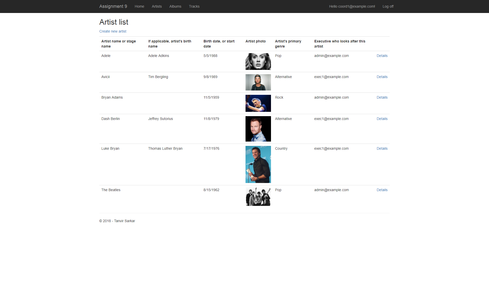
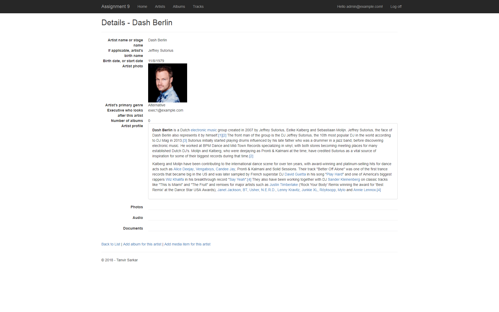
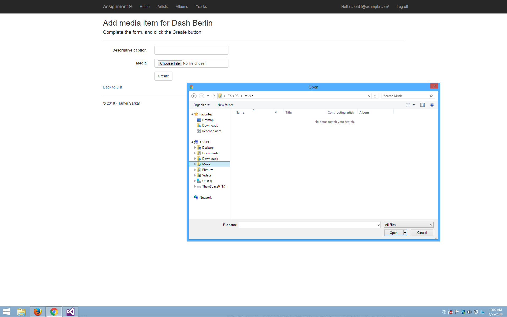
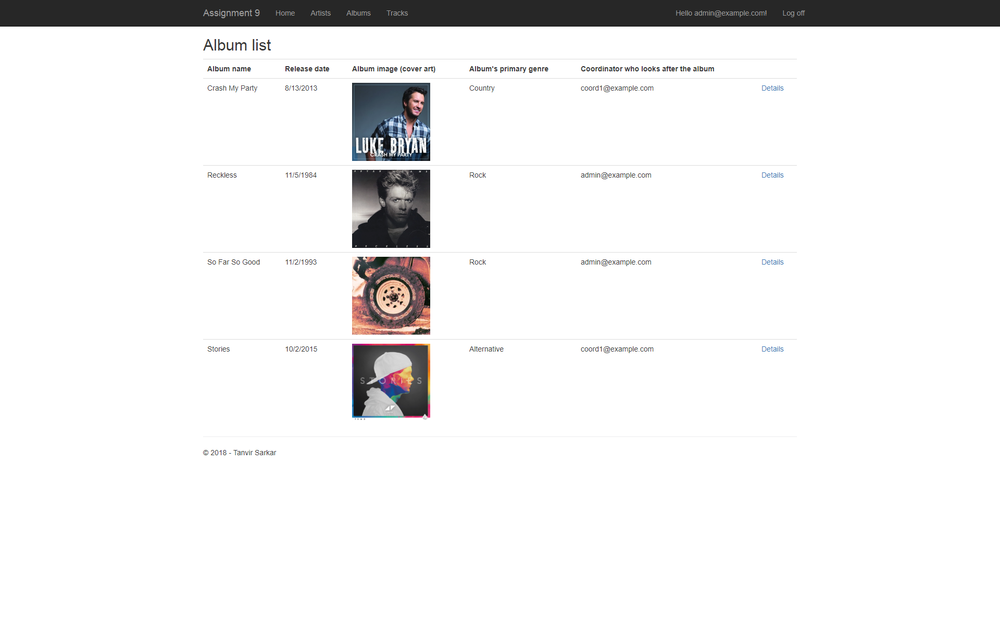
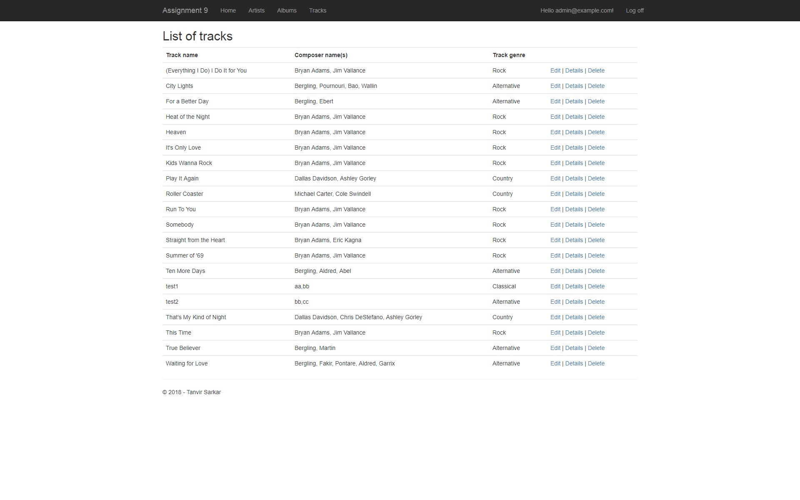
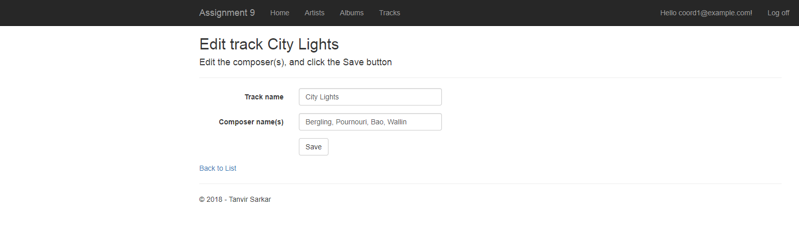

# aspnet-musicstore

This is an ASP.NET MVC 5 web application with CRUD functionality developed to manage various data related to a music store such as employees and customers, as well as music albums, tracks, and artists. The project involved designing custom view model classes and views, tailored to specific use cases. Concepts that were covered in this project included: handling associated data in design model classes, using LINQ to sort collections, building HTML forms, using user roles for security, handling non-text media items, using AJAX and creating partial views, and loading bulk data from csv and xlsx files. 

## User accounts info for testing

Login Emails:

Admin: admin@example.com

Executive: exec1@example.com

Coordinator: coord1@example.com

Clerk: clerk1@example.com

Login Passwords:

pass123! for all accounts

## Instructions

1. Clone or download the repo
2. Open the .sln file in Visual Studio 2015
3. Select which browser you'd like the run the project in (Firefox or Chrome recommended)
4. Run the project

## Screenshots

### Login

### Artist List

### Artist Details

### Upload Item for Artist

### Album List

### Track List

### Edit Track

